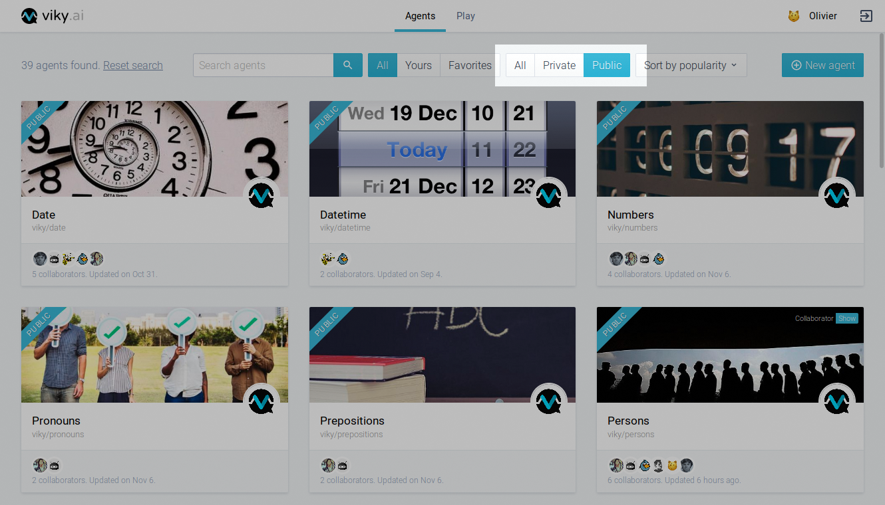
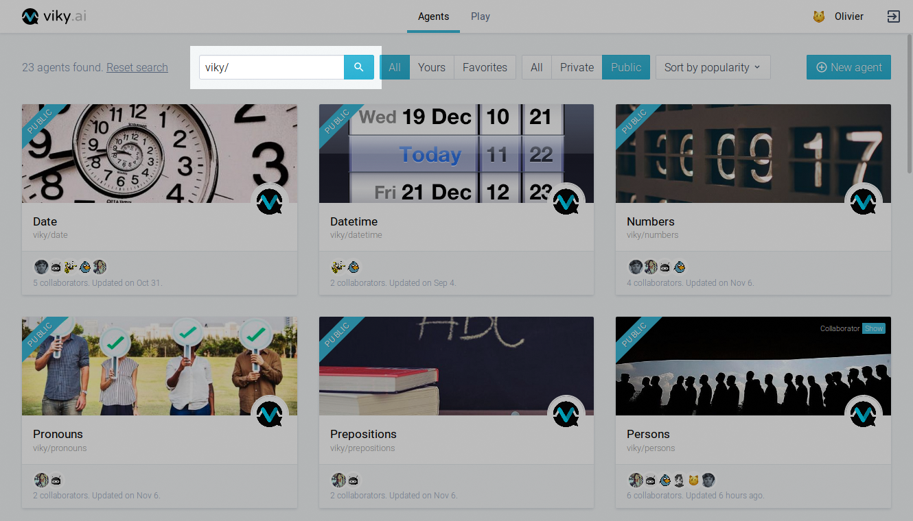
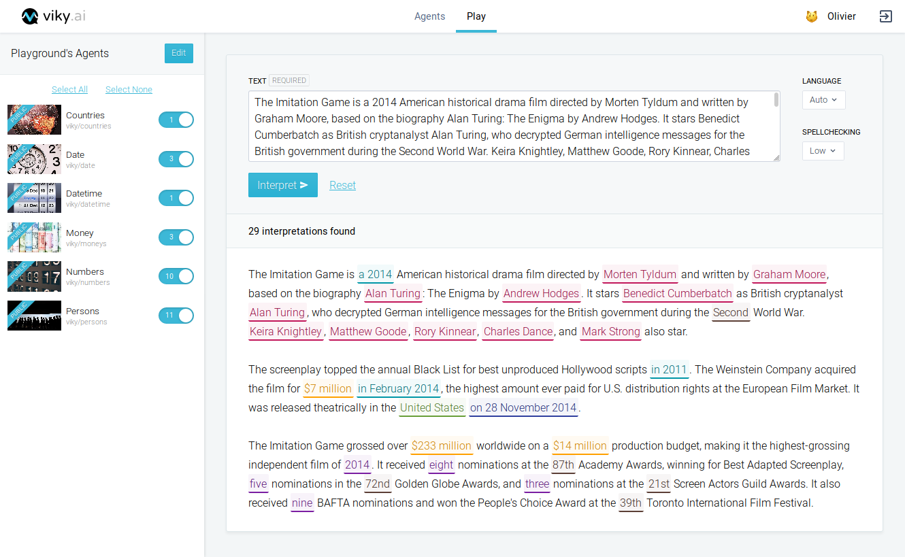
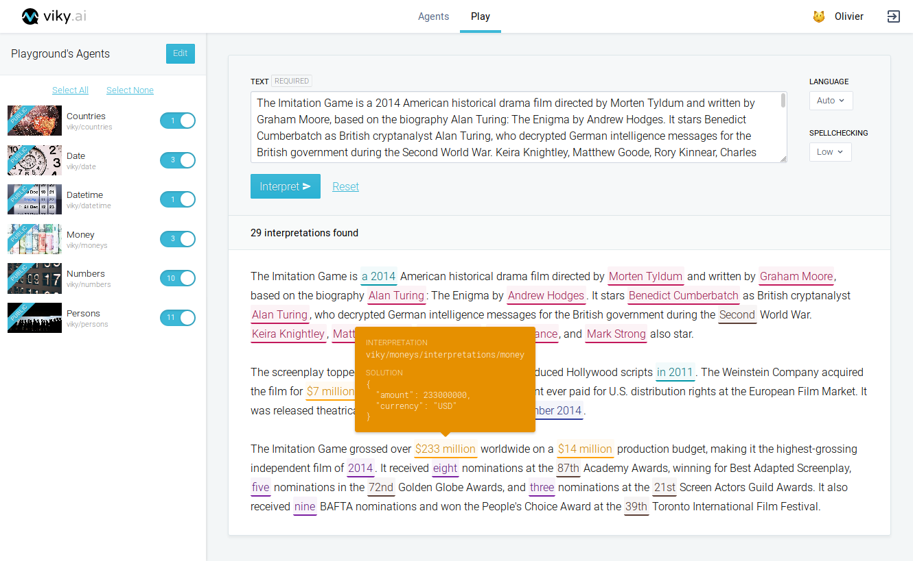
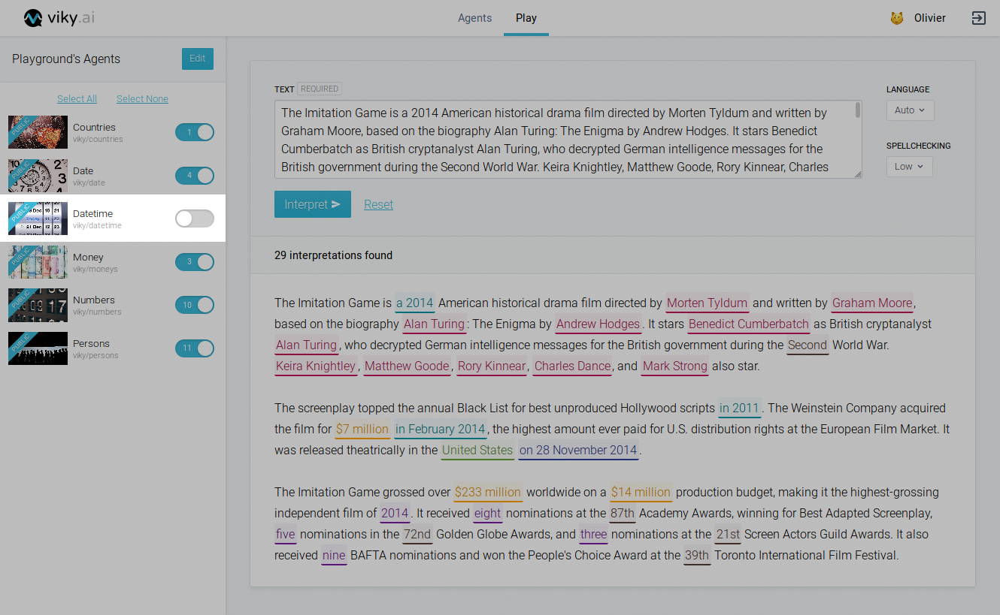
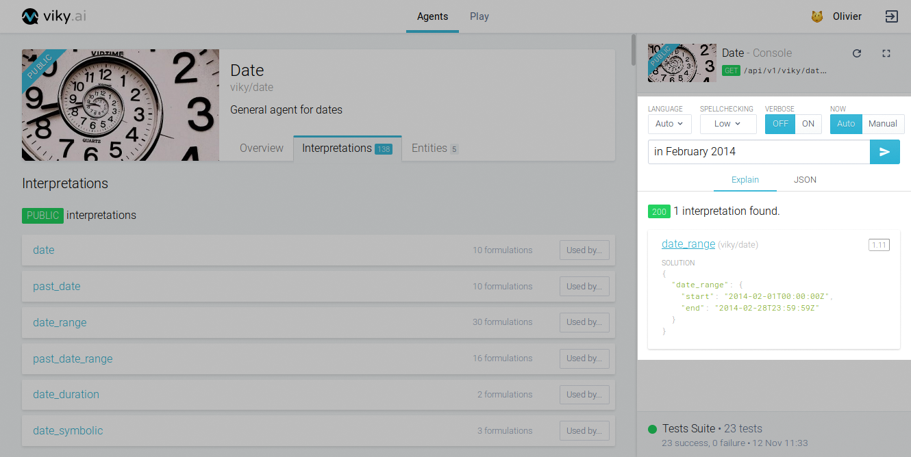

The number of publicly available agents can be overwhelming when you are looking for an existing one that could fit your requirements. Several tools can help you find the best agent for your use case.

In this example we want to analyze texts such as this one:

> The Imitation Game is a 2014 American historical drama film directed by Morten Tyldum and written by Graham Moore, based on the biography Alan Turing: The Enigma by Andrew Hodges. It stars Benedict Cumberbatch as British cryptanalyst Alan Turing, who decrypted German intelligence messages for the British government during the Second World War. Keira Knightley, Matthew Goode, Rory Kinnear, Charles Dance, and Mark Strong also star.
>
> The screenplay topped the annual Black List for best unproduced Hollywood scripts in 2011. The Weinstein Company acquired the film for $7 million in February 2014, the highest amount ever paid for U.S. distribution rights at the European Film Market. It was released theatrically in the United States on 28 November 2014.
>
> The Imitation Game grossed over $233 million worldwide on a $14 million production budget, making it the highest-grossing independent film of 2014. It received eight nominations at the 87th Academy Awards, winning for Best Adapted Screenplay, five nominations in the 72nd Golden Globe Awards, and three nominations at the 21st Screen Actors Guild Awards. It also received nine BAFTA nominations and won the People's Choice Award at the 39th Toronto International Film Festival.
> <cite><a href="https://en.wikipedia.org/wiki/The_Imitation_Game">The Imitation Game</a>, from Wikipedia</cite>

Beyond its cinematic subject this text contains lots of common entities like names, amounts of money, dates and so on. A good way to begin is to search for existing agents and reuse them as dependencies which can save us a lot of work.

## Agents index

The main agents index lists every agents available to you. Some of them have a `public` ribbon meaning any users can access them at least as read-only.

From the agents index you can access the search bar allowing you to filter agents by name, by user name or by slug. You can also filter agents by ownership and by visibility. Use the search bar to filter the list and display only public agents.

Now type the username `viky/`. It is a special account hosting officially supported agents provided by Pertimm. They are excellent building blocks for you projects covering a wide range of interpretation recognitions such as dates, numbers, time, money, countries and much more!

You can sort them by name, by last update or by popularity which is the number of times an agent is used as a dependency. The popularity sort is convenient way to find agents for common expressions.

From here we assume that agents [Countries](https://www.viky.ai/agents/viky/countries), [Date](https://www.viky.ai/agents/viky/date), [Datetime](https://www.viky.ai/agents/viky/date), [Moneys](https://www.viky.ai/agents/viky/moneys), [Numbers](https://www.viky.ai/agents/viky/numbers) and [Persons](https://www.viky.ai/agents/viky/persons) could be useful. Trying each one of them individually would be time consuming and to explore how multiple agents behaves against a certain text we can use the "Play" user interface.

## Using Play

When you narrowed down a set of potentially useful agents for your use case, you can try them in Play. This tool allows you to submit large texts to a selection of agents and asses how they perform against that text.

Go to Play from the navigation bar and select the previous set of agents: [Countries](https://www.viky.ai/agents/viky/countries), [Date](https://www.viky.ai/agents/viky/date), [Datetime](https://www.viky.ai/agents/viky/date), [Moneys](https://www.viky.ai/agents/viky/moneys), [Numbers](https://www.viky.ai/agents/viky/numbers) and [Persons](https://www.viky.ai/agents/viky/persons).

Paste the text and click on `Interpret`.

When the interpretation is done the analyzed result appears below. Every interpretations found is underlined with a different color for each agents. Click on an interpretation to display the details of the match, especially the corresponding solution.

If several interpretations from different agents match the same expression, only the one with the wider coverage is shown.

We can temporarily disable an agent with the right switch. This trigger a new processing of the text without the agent even if still present in the selection. We can see that interesting information are found by every agents. If we look closely, the [Datetime](https://www.viky.ai/agents/viky/date) agent does not add much because it only match one date in the text. If we disable it, the [Date](https://www.viky.ai/agents/viky/date) agent is able to match the remaining date expression and so we can reduce the number of agents in our selection.

## Console

Each agent expose individually a console allowing you to test it by sending sentences to interpret. It responds with matched interpretations as well as the corresponding solution.

Here you can type a sentence and apply the same options as the [public API](../../reference/agents-api/). Those options are:
- `language`: it allows to select the language in which the sentence will be understood. By default this language is in auto detection.
- `spellchecking`: it allows to perform spellchecking with different level such as `Inactive`, `Low`, `Medium` or `High`. The highest the spellchecking will be, the more aggressively the NLP will try to match words even if they are not spelled right.
- `verbose mode`: it allows to have some debug information in order to understand how the match is performed by the NLP.
- `now`: it allows to set a fixed current date and time as desired.

Go to one agent of our list, [Date](https://www.viky.ai/agents/viky/date) for instance. In the console try a few sentences to really grasp how this agent works.

## Other places

An other way to assess what an agent can do is to read its "Readme" section in the agent overview. It is a great way for the agent's owner to explain how the agent is supposed to work and in what context.

When available, non regression tests are also an interesting source of understanding what kind of sentence the agent is able to process. Non regression tests are located in the lower part of the console and is called "Tests Suite".

