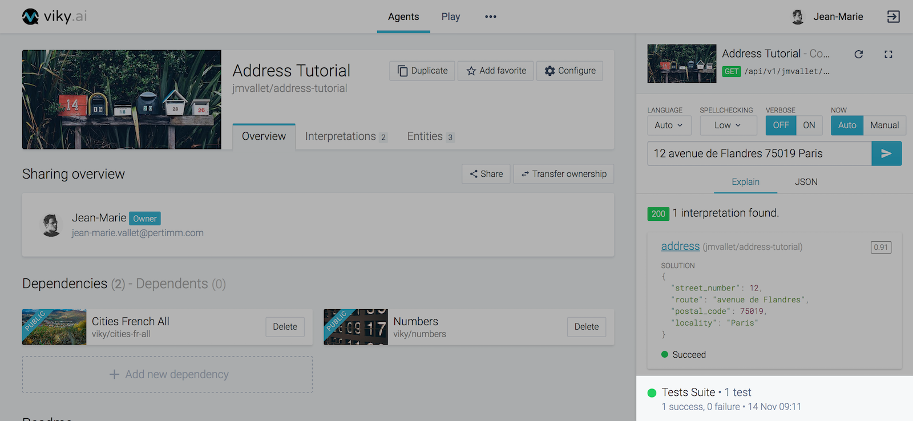
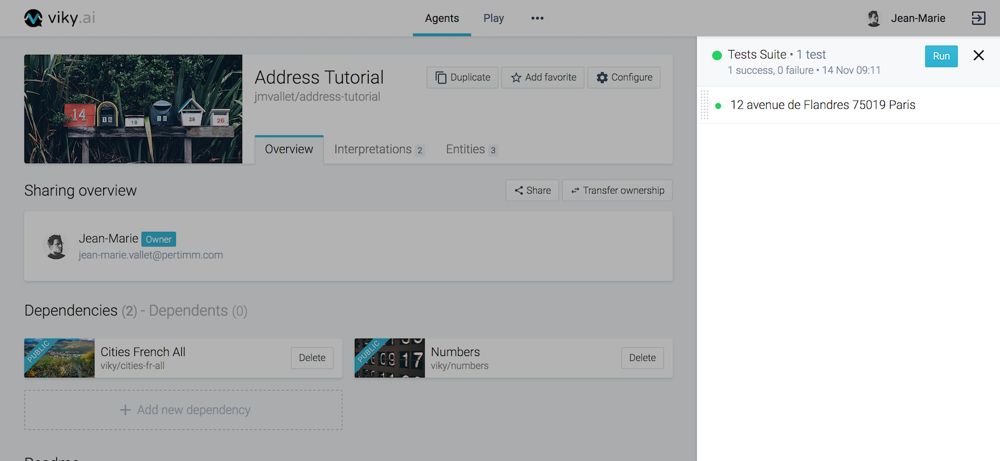
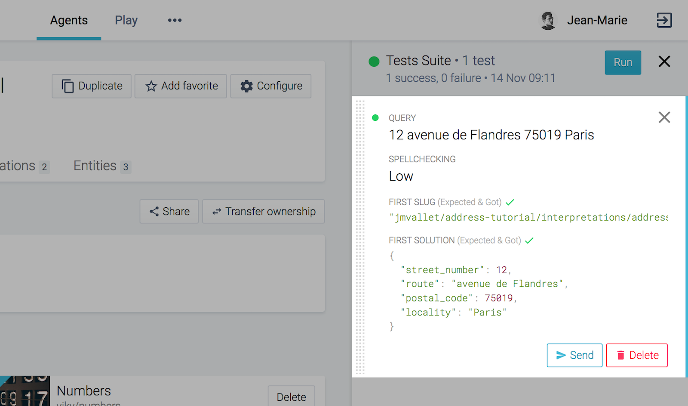
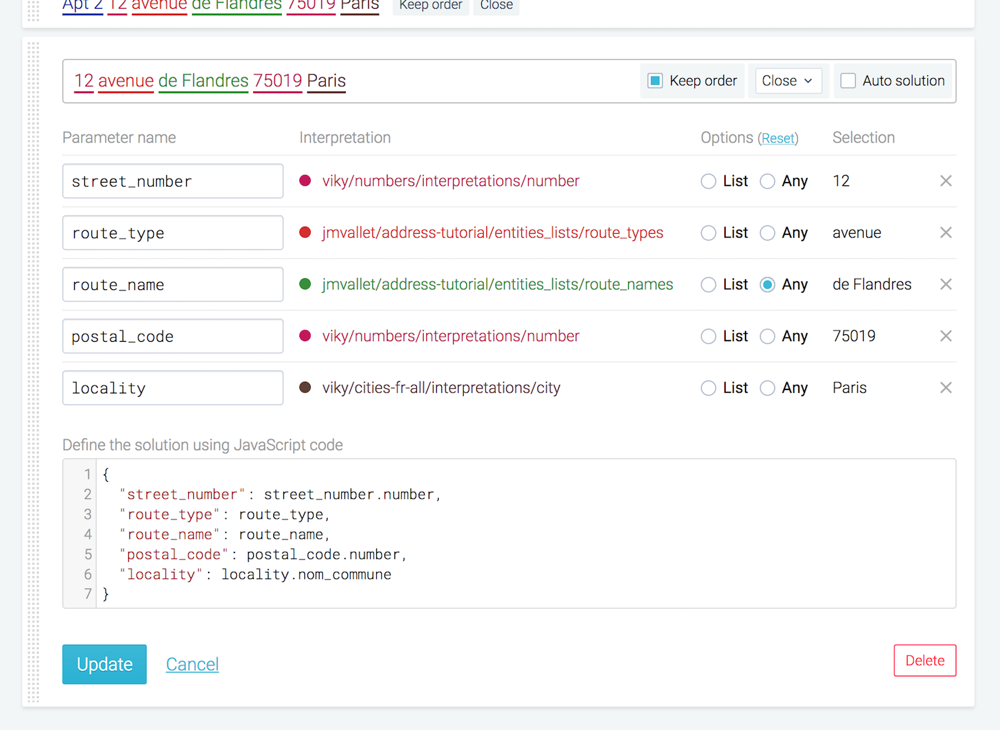
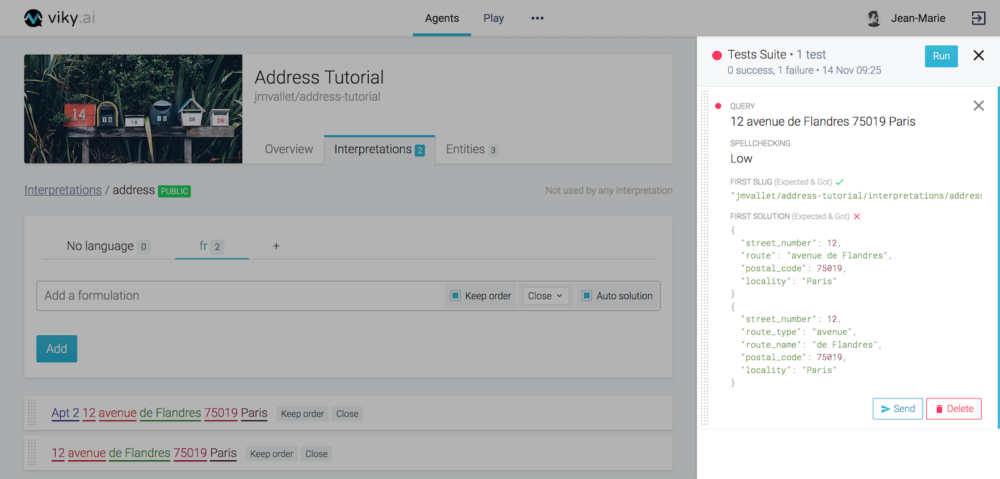
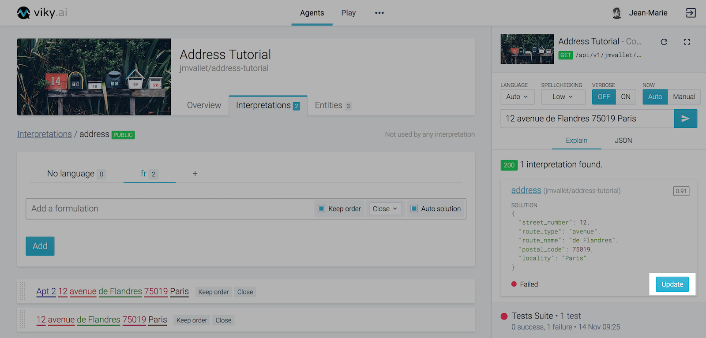
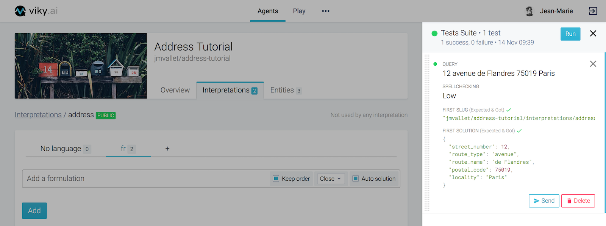
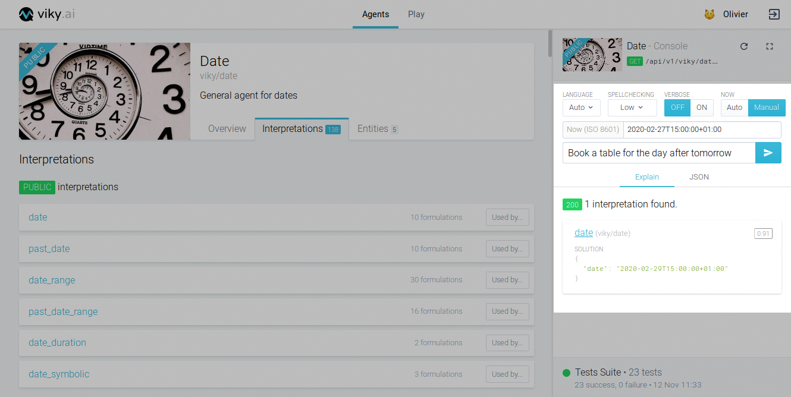

Your agent can undergo many changes. So you need to make sure that with each change, your agent always behaves the way you want. viky.ai has the concept of regression testing to help you do this.


## Adding a non regression test

Let us see how we can create a non regression tests suite for the "Address Tutorial" agent that we created in the "[Getting started](/doc/tutorials/getting-started-part-1/)" tutorial.

Every time you ask your agent to interpret a sentence, you will be given an option to add the sentence to the test suite. Type "12 avenue de Flandres 75019 Paris" in the text field of the console and send the request. You will see a "Add to tests suite" button on the bottom right corner of the "Explain" tab.


Click the "Add to tests suite" button. You will now see that a "Tests Suite" has been created at the bottom of the console. You can see the summary of your test suite there.



Click on the summary. You will now see the tests suite with the test that you previously added.



Clicking on the test will show you its details:

* `Query` i.e. the sentence for the test
* Different options chosen during the interpret request: `Spellchecking`, `Language` and `Now`
* `Slug` of the first interpretation found for the sentence
* `Solution` for the sentence



## Updating an existing test

Till now you can see that the Tests Suite is green which means all the tests have passed. The test details shows us that the expected and got values for the slug and the solution match.

Let us try to edit our agent and see what happens to the tests suite.

Edit the solution for the formulation in address interpretation as below:

```javascript
{
  "street_number": street_number.number,
  "route_type": route_type,
  "route_name": route_name,
  "postal_code": postal_code.number,
  "locality": locality.nom_commune
}
```



As soon as you updated your interpretation, you will see that the tests suite ran the test and updated its result. You will now see that the test has failed. You can also see what failed in the test - in our case its the solution that did not match. The test detail shows what was the expected solution and what solution was returned.



Click on the "Send" button. It prompts the console to interpret the sentence again. You will see that the console now returns the new solution that we just updated earlier.



The console also indicates that the test for this sentence is in failed state. Click on the "Update" button. You will see that the test passed and the expected solution for the test was updated with the new solution.



Thus, you have seen that with each change in your agent, your test suite will run and tell you if the tests you added were successful or failed with your new changes. You can add several tests for different types of sentences that your agent can interpret. You can now be sure that your agent behaves as expected every time you make changes.

Another way to use non-regression tests when exploring other agents in viky.ai is to consult their test suite and understand the type of sentences that the agent is able to understand without having to review interpretations and entity lists.

## Testing a sentence with a time reference

Testing an agent using time reference can be difficult. For instance if the agent is able to understand "Book a table for the day after tomorrow" and translate the expression "the day after tomorrow" in a normalized ISO 8601 format as its interpretation's solution, the corresponding date will change every day.

To do this, you can use the "now" option in the console by switching it to `manual`. It allows you to freeze the current time used to interpret the sentence.

If you set the "now" option to `2019-02-27T15:00:00+01:00` ( _February 27, 2019_ ) the solution will be two days later `2019-03-01T15:00:00+01:00` ( _March 1st, 2019_ ).


If you set it to `2020-02-27T15:00:00+01:00` ( _February 27, 2020_ ) the solution will also be two days later `2020-02-29T15:00:00+01:00` ( _February 29, 2020_ ) but still in February since it is a leap year.


