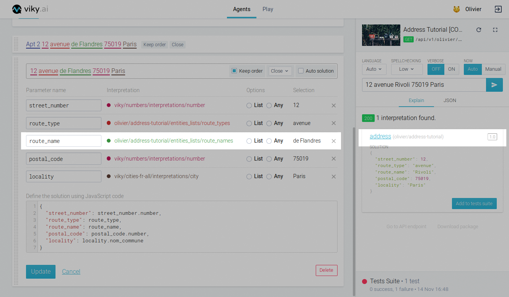
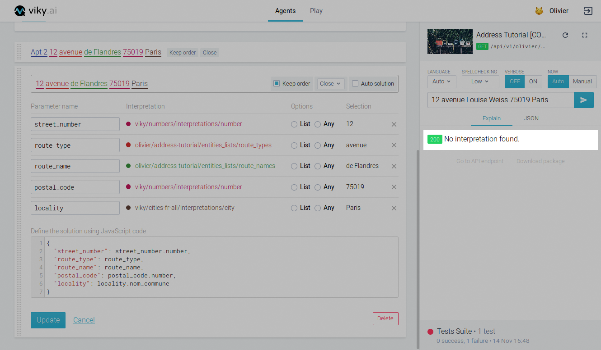

Usually your agent will use annotations to define the sentence structure. But having a well defined and consistent structure an be challenging and even sometimes impossible. One way to solve this problem is to use the `Any` option.

## Match anything

When annotating a formulation, a special option `Any` is available. It allows the agent to match anything on this position in the sentence and bind it to the associated JavaScript variable in the solution.

You already saw how an agent can match an unexpected road name for the `Address Tutorial` agent that we created in the [Getting started](/doc/tutorials/getting-started-part-3/#route-name) section. Let's dig a little deeper this example.

First remove the `Any` option of the "route_names" annotation if it is already set. Do so on every formulations in the "address" interpretation. The associated entities list should only contains two entities: "Champs Elysées" and  "Rivoli".

Try the sentence "12 avenue Rivoli 75019 Paris" in the console. Note the matching interpretation score. Since it is a perfect match so we have a perfect score of `1.0`.

Change de road name to something that is not part of the entities list such as "12 avenue Louise Weiss 75019 Paris". Try again in the console. Nothing match.

<aside class="note">
  <h3>Note</h3>
  

    For better results, frame your <code>Any</code> annotation between two others matching expressions so the NLP knows when the <code>Any</code> starts and ends. 
  

</aside>

Now reenable the `Any` option on the "route_names". Retry your previous sentence with the unknown road name, in this example "12 avenue Louise Weiss 75019 Paris".
The interpretation match because even if a part of the sentence is still missing the NLP is now forced to fill the blank. Note that the score is lower because of this option.

If you type the road name with the known road name, here "12 avenue Rivoli 75019 Paris" the score is `1.0` again even with the `Any` option still present.

What happen is that the annotated interpretation or entities list will be used in the first place but if nothing match then the `Any` option will serve as a fallback and will gather the corresponding text anyway. In that case the associated score will be decreased compare to not triggering the `Any` option.

<aside class="warning">
  

    The use of the <code>Any</code> option is very powerful but since it has a "catch all" behavior, you should use it with caution. 
    To prevent potential misuse, two restrictions are enforced by viky.ai. First you must have at least two annotations to enable an <code>Any</code> option. Second you can have at most two <code>Any</code> options enabled.
  

</aside>
