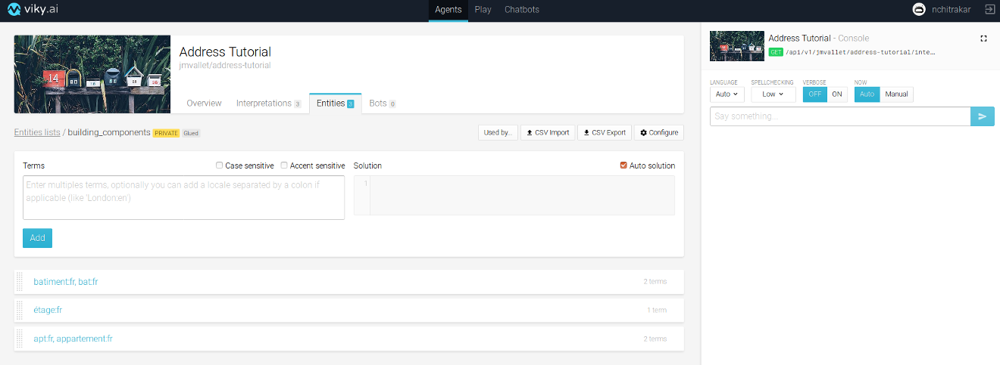
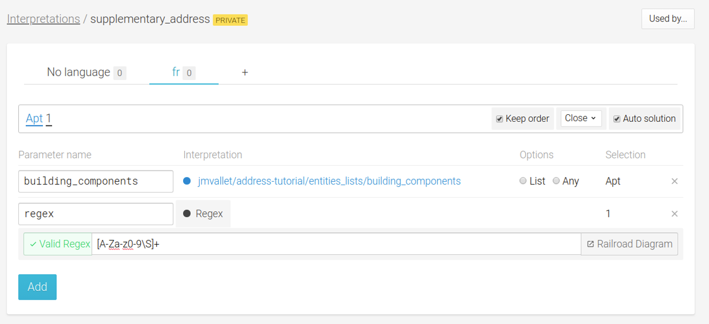
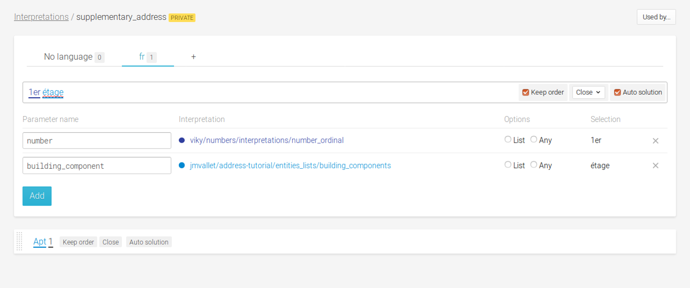
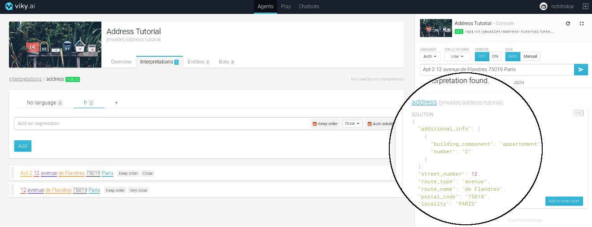
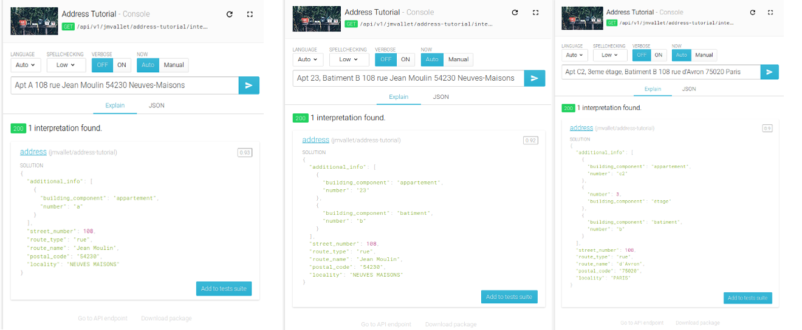

TODO or remove

## Interpretation with a list of similar phrases

Let us again go back to our `Address Tutorial` agent. An address can contain additional information such as the apartment number, building number, floor number and so on. These are all optional information in an address.

Addresses with additional info can take the form of any one of the following:
* Apt 2, 12 avenue de Flandres 75019 Paris
* Apt 2, Batiment B, 12 avenue de Flandres 75019 Paris
* Apt 2, 1er étage, Batiment B, 12 avenue de Flandres 75019 Paris

Let us see how we can incorporate this in our agent.

One way would be to create separate expressions for each of these sentences. However, the better and non repetative way is to treat this additional information in the address as a list. Let us see how we can do this.

Let us first create a few components that will recognize the additional information in the address.

Step 1 Create an entities list `building_components` which contains the terms "batiment", "etage" and "apartment".

Step 2 Create a private interpretation `supplementary_address` to recognize the additional information in an address. Add the following expressions in the interpretation:
* Add "Apt 1" as your first expression.
  * Highlight "Apt" and create an alias to the `building_components` entities list you created earlier.
  * Highlight "1" and create an alias to `Regex` type. Enter "[A-Za-z0-9\S]+" in the text box for regular expression.

* Add "1er étage" as your second expression.
  * Highlight "1er" and create an alias to `viky/numbers/interpretations/number_ordinal`.
  * Highlight "étage" and create an alias to the `building_components` entities list.

Now that we have an interpretation to recognize the additional information in an address, let us create an expression for addresses with additional information.

Add an expression "Apt 2 12 avenue de Flandres 75019 Paris" in the **address** interpretation. Create highlights as follows:
1. Highlight "Apt 2" and create an alias to the `supplementary_address` interpretation you created in the previous step. Select the option `List`.
2. Highlight other part of the address like before.

Test the expression "Apt 2 12 avenue de Flandres 75019 Paris" in the console.

You can see that the solution for the additional information is structured in an array. The `List` option that you selected for alias to the `supplementary_address` interpretation tells the NLP that it can contain more than one number of such interpretation. That is why the solution is structured in an array.

Let us test some other expressions with building information, floor numbers, etc.

Your agent can now recognize addresses with multiple additional information.

