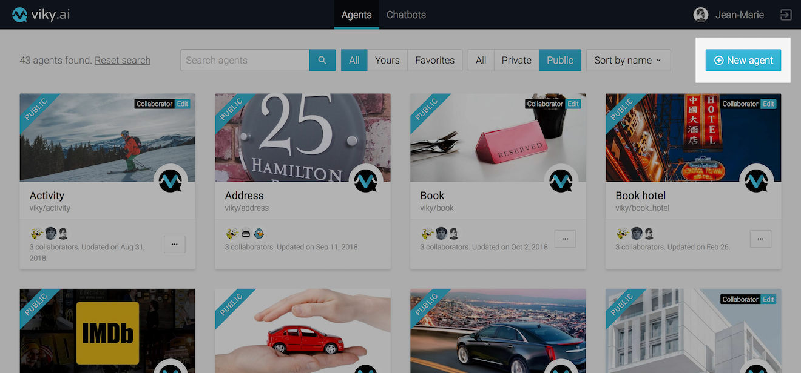
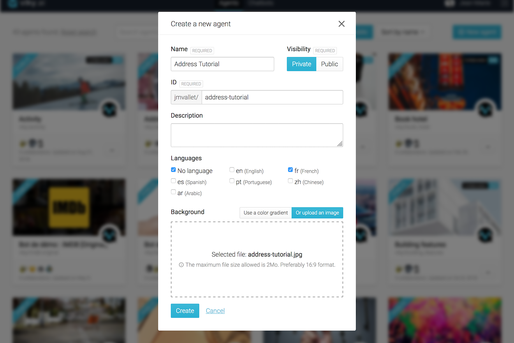
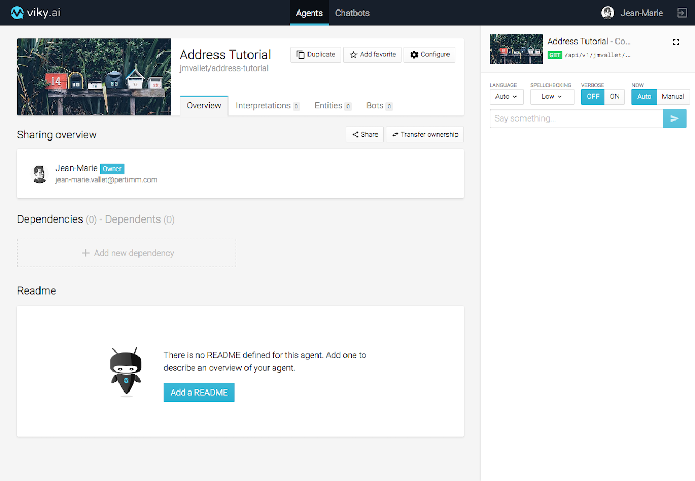

## Purpose

This guide will assist you in the creation of your first project into viky.ai.

We will guide you to create your first agent to structure information from contents and to retrieve relevant information in these contents by interacting with your data in natural language.

The use case to start on the platform is very simple and will demonstrate the different viky.ai's capabilities:

- You have some contents where you want to retrieve the postal address, to create some metadata for instance to classify the information.
- Furthermore, you have customers who want to query these contents by searching with a postal address. Queries should be in natural language to facilitate the interactions.

Concretely, you will create an agent allowing you to send a text to the [viky.ai Agents API](../../api/agents/) and it will extract the French postal addresses in a structured way.

<aside class="warning">
  
TODO: add an illustration.

  <pre>[text] => {API viky.ai} => [Text w/ highlight + JSON solutions]</pre>
</aside>

## Best practices to start

__Definition of the perimeter and the usage is your priority before starting__ any new project on viky.ai. It will help you to ensure the right creation of agents.

<h3>
  1st step
  What is a postal address?
</h3>

- A _postal address_ contains generally a road, its number, a postal code, a town.
- It could also contain additional information about the floor, the apartment, the building.
- It would be interesting to have the GPS details of the town to imagine a use on a map.

_Postal addresses_ could be slightly different from one country to another. So let's started in this tutorial with french postal address!

A typical example is: _12 avenue de Flandres 75019 Paris_ (find some information about postal addresses on [Wikipedia](https://en.wikipedia.org/wiki/Address#France)).

<h3>
  2nd step
  Can I reuse components or should I create everything from scratch?
</h3>

Think about the elementary components you will need to create agents able to identify a postal address.

In the example "12 avenue de Flandres 75019 Paris", the decomposition into elementary elements gives :

<aside class="note">
  <h3>Tips and tricks</h3>
  

    Open resources exist on the web to facilitate the creation of these elements.
  

  

    For instance, road types are available on <a href="https://fr.wikipedia.org/wiki/Odonymie_en_France#Types_de_voie">Wikipedia</a> or on this <a href="https://gist.github.com/384400/bf3c83a4e7d1aa66a87e">GitHub Gist</a>.
  

</aside>

- `12`: Number.
- `avenue`: Road type.
- `de Flandres`: Road name.
- `75019`: Postal code (i.e. a specific pattern of numbers).
- `Paris`: City.

It could optionally contain information about the apartment, building, floor.

viky.ai contains already some generic agents to support you in this creation: numbers and French cities.

We will create a module (named *Agents* in viky.ai's world) able to identify each part of the address, and a postal address.

## Create an agent

Login to viki.ai. You will then come to an interface listing the available agents. Then click on the **New Agent** button.

A modal box with the form "Create a new agent" opens.

<aside class="note">
  <h3>Tips and tricks</h3>
  

    <code>ID</code> must be URL-compatible. Use unaccented, lowercase characters and separate the words with dashes (<code>-</code>).
  

</aside>

1. Fill the `Name` field with "Address Tutorial".
2. Set the `Visibility` as `Private`, so you will be the unique owner of the agent, to see, use or modify your agent.
3. Fill the `ID` field with "address-tutorial".
4. Check the following options for languages: `No language`, `fr (french)` and uncheck `en (english)`.
5. Choose a background color or upload an image.
6. Submit form with **Create** button.

The agent is now created. By default, you land on the **Overview** tab of the agent.

On the left part of the UI, you can edit agent's configuration, manage access rights, dependencies and add a Readme to describe your agent. On the right part, a console allows you to play with the agent, but we will come back to it later.

<aside class="primary">
  

    You can add a <strong>Readme</strong> in this <strong>Overview</strong> section. This is particularly useful to add a description of the purpose of your agent, and some examples of what it will be able to do. For this tutorial, copy/paste the purpose of the tutorial in the <strong>Readme</strong> section. Add the following examples of french postal addresses as an illustration (it will serve also as unitary tests during the agent creation). Examples should be as representative as possible.
  

  <ul>
    <li>12 avenue de Flandres 75019 Paris</li>
    <li>108 bis rue Jean Moulin 54230 Neuves-Maisons</li>
    <li>240 Impasse du Fief du Breil 44690 La Haie-Fouassière</li>
    <li>3 Passage Pommeraye 44000 Nantes</li>
    <li>1 Rue de la Miséricorde, 20200 Bastia</li>
  </ul>
</aside>

## Let's add some dependencies

In order not to reinvent the wheel, you will add 2 dependencies as seen above: **Numbers** and  **VillesFR**.

Step 1 Click on **Add new dependency**

Step 2 Search and choose **Numbers** public agent

Step 3 **Numbers** agent is now in yours dependencies. Let's add an other.

Step 4 Click on **Add new dependency**, search and choose **VillesFR** public agent

Done  Well, both dependencies are in place.

<aside class="warning">
  
TODO: add info on Numbers & VillesFR capabilities. First console example ?

</aside>

## First interpretation

### Create an interpretation

In the **Interpretations** tab, click on **New Interpretation** button.

Fill the `ID` with "address".

Interpretation can be set as **Public** or **Private**:

- A **Public** interpretation will be able to return a solution as a result.
- A **Private** interpretation can only be used for calculation or computation.

Set your interpretation as **Public** and click on **Create**.

### Create your first expression

The interpretation is created, now click on it, select the **fr** tab and type "12 avenue de Flandres 75019 Paris" in the text area, then click on **add**.

Let the default options as they are (_keep order_, _close_, _auto solution_). We will back to them later.

### Testing the Agent

A console panel is on the right to test in live your agent. Type "12 avenue de Flandres 75019 Paris" in the text area and click on the arrow to send the request. This console calls your agent by REST API.

You can see the returned solution in the **Explain** tab (opened by default). The solution is available also in JSON format, click on the **JSON** tab to check it.

The return value is an interpretation, the solution is just a part of the interpretation and the score is the match exactitude level, 0 means no match, and 1 means a complete exact match.

<aside class="primary">
  

    The <strong>Console</strong> has different usages. It could be a place to realize your unitary tests, each time you create a new interpretation, to validate it.
  

  

    It allows also to save your tests to create a <strong>Test Suite</strong>. This is a best practice to have in NLP projects, to have continuous improvements with a view of potential regressions.
  

  

    Once you run a test, you can add it to Test Suite by clicking on the related button.
    It is then possible to launch a global run on all saved tests.
  

</aside>

## Variabilize the interpretation

You may want to be able to identify any _French postal address_ with other numbers, road types and names, and cities.

We will create sub-interpretations to variabilize each element of the initial address model we have created.

### Create a sub-interpretation

Go back in the **Interpretations** tab and click on **New Interpretation**.

<aside class="note">
  <h3>Tips and tricks</h3>
  

    We recommend best practices to name your interpretations and entities.
  

  <ul>
    <li>Names are always in English.</li>
    <li>Use the singular form to name an interpretation.</li>
    <li>Use plural form to name an entities list.</li>
  </ul>
  

    In the above example, <em>road types</em> will have a "road_type" name for the interpretation, and we will name the list of types in the entities tab <em>road_types</em>.
  

</aside>

We will start with the road types.

Enter "road_type" as an `ID`, let this interpretation as `Private` mode, then click on **Create** button.

Click on this new interpretation named "road_type".

Select the **fr** language tab, enter the expression "main_road_type" and then click on **Add**.

The "shell" to call road types is ready. We will create a list of related entities.

### Create the road type entities

Click on the **Entities** tab and click on **New entities list**.

Type "road_types" in the `ID` text field, select Private and Glued options, and click on **Create**.

Click on the entity list to open it and enter road types names:

- type "rue" in the **Terms** text area ; then click on **Add**,
- type "avenue" in the **Terms** text area; then click on **Add**,
- type "impasse" in the **Terms** text area; then click on **Add**,
- type "passage" in the **Terms** text area; then click on **Add**,
- etc...

<aside class="primary">
  

    It is possible to import long lists of entities into viky.ai. viky.ai accepts CSV format.
  

</aside>

### Link entities to interpretations

Go back in **Interpretations** tab, click on **road_type** private interpretation, click on **main_road_type** and highlight **main_road_type** entry.

A drop-down list appears, displaying the different interpretations available for variabilization.

Select the **road_types** entities (it should be labeled like `yourname/youragent/entities_lists/road_types`), and click on **Update**.

Go back in the **address**  public interpretation and highlight "avenue" in your expression "12 avenue de Flandres 75019 Paris".

In the drop-down list, select  **road_type** interpretation, and click on **Update**.

Test the interpretation with the sentence "12 avenue de Flandres 75019 Paris", the result should be the same as your first test.

Test it now with the sentence "12 **impasse** de Flandres 75019 Paris", it should be successful as well.

### Customizing the solution

Now we're going to make understandable the rest of the sentence for the system.

- Highlight "**12**" and create an alias to the `viky/numbers/interpretations/number` interpretation.
- Highlight "**75019**" and create an alias to the `viky/numbers/interpretations/number` interpretation.
- Highlitht "**Paris**" and create an alias to the `viky/villesfr/interpretations/cityfr_entities` interpretation.
- Don't highlight the street name for the moment, we'll come back on it later.

If you try to update the expression, an error will be displayed because the variable `number` is used twice.

Set the second **number** to **postal_code** to make it available, and set **cityfr_entities** to **city** for an easyer reading.

Click on **update**.

Test now the sentence "12 avenue de Flandres 75019 Paris".

All the part are correctly understood, but the result is almost unreadable.

We will now customize the output in order to make it correctly readable.

Open the expression and uncheck **Auto solution**, a textfield is open in the bottom of the expression.

This textfield allows you to customize the solution.

The solution is a json map, and you can use all the variables listed in the **Parameter name** area.

Update the solution in order to have a solution like this:

    {
      number: number,
      road_type: road_type,
      postal_code: postal_code,
      city: city
    }

The solution is now like this:

This is much more readable, but it is still not completely OK.

Let's remove the extra **number** and only keep the city name for the moment.

The solution will be

    {
      number: number.number,
      road_type: road_type,
      postal_code: postal_code.number,
      city: city.name
    }

Now the solution is:

Which is much better.

### Understanding unknown words

We will try now to understand the street names.

All the street names are too much to be imported easily in viky.ai, so we will try to manage to make the system understand unknown street names.

First create a new private entities list **street_names**.

Fill it with some very known street names such as **Champs Elysees**, **Rivoli**, etc...

Go back in the **Address** interpretation, edit the expression and highlight **de flandres**.

Create an alias to the entities list **street_names**, then select **any** for this alias and add it to the solution.

Test now the sentence "12 avenue de Flandres 75019 Paris".

All the part are correctly understood, even the street name.

Try now another completely different address, for example: "52 avenue Breteuil 13008 Marseille", it works!

